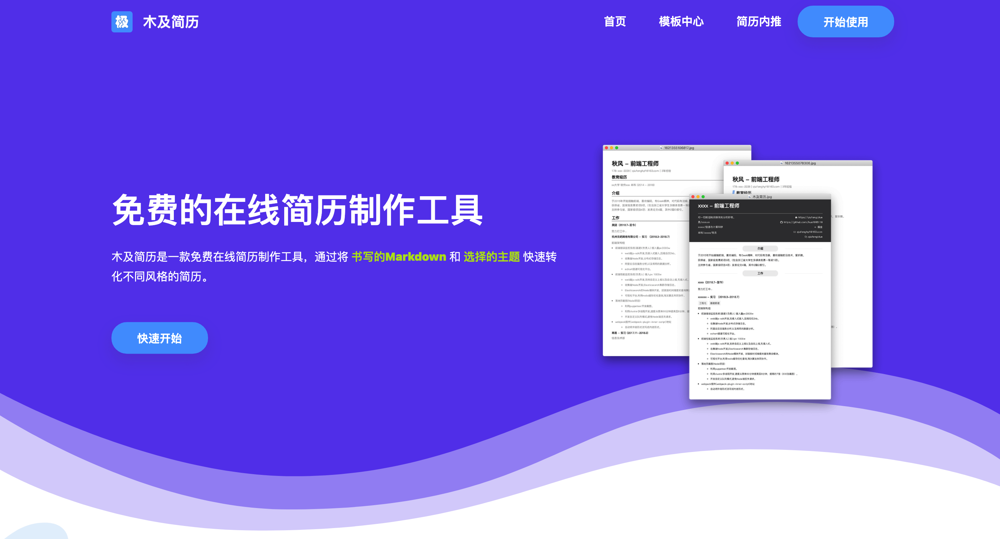

# 🏅️「木及简历」是什么？

木及简历，是一款只用`markdown`就能写出好看简历的**免费在线工具**。 

我们希望**帮助你**「以最简单的方式来写好简历，只需专注于自身的内容而无需关注排版」

立即体验 👉  [https://resume.mdedit.online](https://resume.mdedit.online) 

基础版开源于Github，欢迎Star  👉 [https://github.com/hua1995116/react-resume-site](https://github.com/hua1995116/react-resume-site)

### 「木及简历」的特点

 📝 **1. Markdown书写方式，简单易上手**

\*\*\*\*🎯 **2. 实时预览PDF并导出，导出效果「所见即所得」**

\*\*\*\*✨ **3. 智能一页**

\*\*\*\*🎏 **4. 海量「极简」主题与模板**

### 更多

如果你对 Markdown 不熟悉或在书写简历过程中遇到问题，可以先查看我们编写的「**实用基础教程**」：



❓ **FAQ : 查看常见问题回答**



👫 **关于我们**



一个产品的价值永远应该建立在「如何帮助使用它的人实现价值」之上。

我们希望在简历制作过程中，可以帮助你更多的专注于自己的**思考与总结**，成为更好的自己。

「木及简历」自上线以来一直在保持着稳定的更新迭代。投入大量业余时间来维护是件很不容易的事，但有了你们的支持与鼓励，木及简历一定会走的越来越好。

如果你有任何问题、建议和意见，欢迎采取以下任意联系方式与我们交流 👏

微信 🌱 ：秋风\(qiufengblue\)、楠溪\(xiyou6\)

邮箱 📩 ：qiufenghyf@163.com

群聊 🏃 :  

